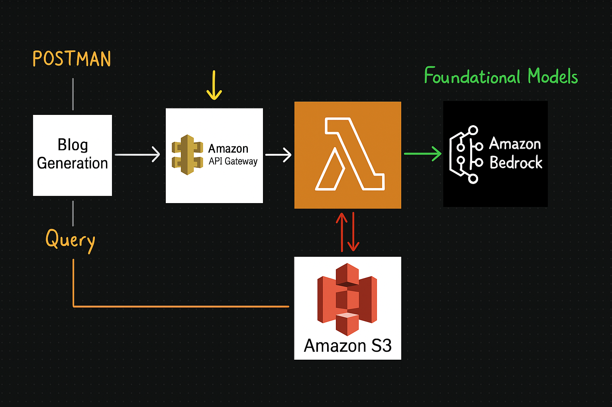
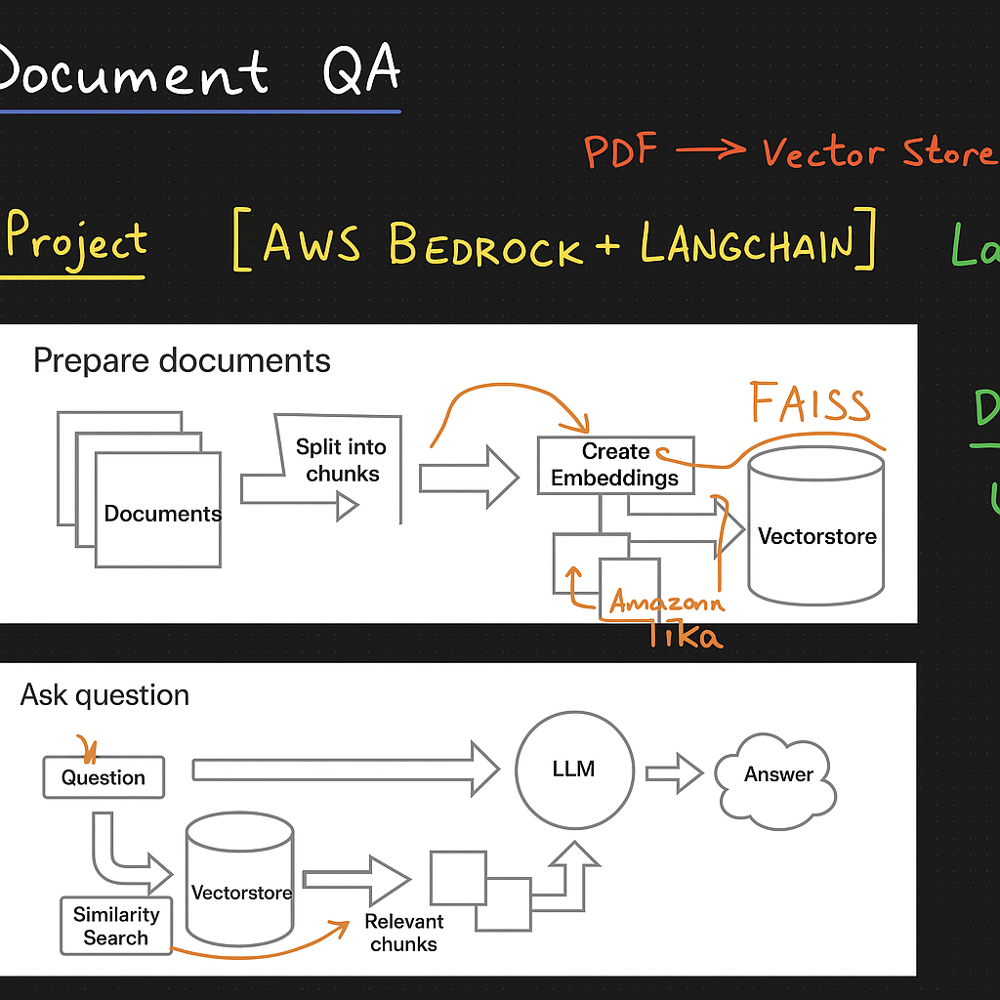
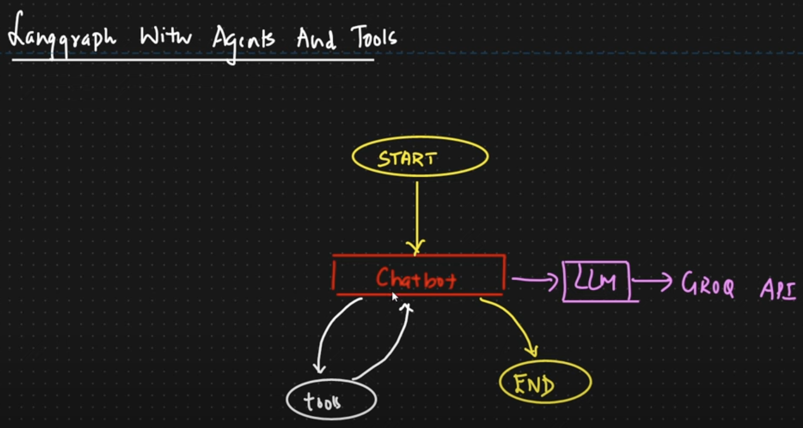

# AWS-Bedrock-Langchain

This repository contains LLM apps for blog generation, retrieval-augmented generation (RAG), and multi-step agent workflows using **AWS Bedrock**, **AWS Lambda**, **LangChain**, and **LangGraph**.  
The projects are based on tutorials by [Krish Naik](https://www.youtube.com/@krishnaik06) and content from his Udemy course.

## Project Overview

### 📝 Blog Generation
- Built a serverless blog generation application using AWS Bedrock (LLaMA-2-13B) for LLM-powered text generation and AWS Lambda for backend orchestration. The system uses Amazon API Gateway to expose a public REST API endpoint that accepts blog generation requests from Postman. When a user submits a query, API Gateway triggers a Lambda function, which handles the request, queries the foundation model via Amazon Bedrock, and stores the generated blog context to Amazon S3.

  

---

### 📄 PDF Question Answering with RAG
- Built a document QA pipeline using AWS Bedrock (Claude) and LangChain that extracts text from PDFs, chunks them, creates embeddings from Amazon Tika, and stores them in a FAISS vectorstore. Implemented a retrieval-augmented generation (RAG) workflow where user questions trigger similarity search over vectorstore chunks, feeding relevant context to the LLM prompts for accurate answers. Integrated the system with a Streamlit front-end for user interaction.

  

### 🤖 LLM Agentic Workflow
- Built an LLM agent workflow using LangGraph, where a Chatbot dynamically routes between tool usage (e.g., Wikipedia search, ArXiv search) and LLM calls via the Groq API, supporting a multi-step conversational flow with a defined start and end state.

  

